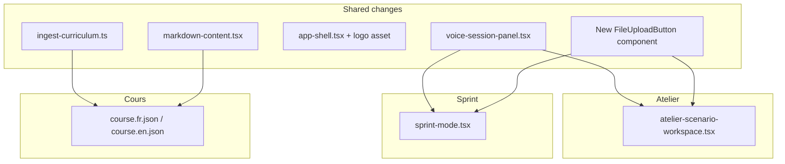

# Design UX refinements plan

## Scope map

---

## 1. Single pause/resume button (Atelier + Sprint)

**Where:** [`ircom-app/components/atelier/voice-session-panel.tsx`](ircom-app/components/atelier/voice-session-panel.tsx) — shared by both modes via `VoiceSessionPanel`.

**Current:** Two separate secondary buttons (`narration-pause`, `narration-resume`); only one is ever actionable.

**Change:**
- Replace with one toggle button that:
  - Shows **Pause** (+ pause icon) when `canPause` is true
  - Shows **Resume** (+ play icon) when `isPaused` (`canResume`)
  - Is **disabled** when neither applies (idle, connecting, or post-briefing idle)
- Keep `data-testid="narration-pause-resume"` (or retain `narration-pause` and drop `narration-resume` — update any tests if added later)
- Keep existing paused hint (`session-paused-hint`) unchanged
- No hook changes — still call `pauseBriefing()` / `resumeBriefing()` from [`use-voice-briefing.ts`](ircom-app/lib/hooks/use-voice-briefing.ts)

**Copy:** Reuse existing `pauseNarration` / `resumeNarration` keys in [`lib/copy/ui-messages.ts`](ircom-app/lib/copy/ui-messages.ts).

---

## 2. Raise hand as icon (Atelier + Sprint)

**Where:** Same `VoiceSessionPanel`.

**Current:** Text button `"Lever la main"` / `"Raise hand"`.

**Change:**
- Replace label with an inline SVG hand icon (no new npm dependency — project has no icon library in [`package.json`](ircom-app/package.json))
- Add `aria-label={t(language, "raiseHand")}` and optional `title` for tooltip
- Keep `data-testid="raise-hand"`
- Optional listening indicator: small pulsing dot or `aria-live` text in `sr-only` span instead of visible `"…"`
- Add minimal icon set in new [`components/ui/icons.tsx`](ircom-app/components/ui/icons.tsx) (HandRaisedIcon, PauseIcon, PlayIcon, UploadIcon) for reuse

**UX gate:** 44px touch target preserved via existing `Button` min-height; icon-only must not shrink below touch minimum.

---

## 3. Obvious upload button (Atelier)

**Where:** [`ircom-app/components/modes/atelier-scenario-workspace.tsx`](ircom-app/components/modes/atelier-scenario-workspace.tsx) lines 159–181.

**Current:** Native `<input type="file">` full-width — unclear click target.

**Change — new shared component** [`components/ui/file-upload-button.tsx`](ircom-app/components/ui/file-upload-button.tsx):
- Hidden `<input type="file">` triggered by a styled secondary `Button` with upload icon + label ("Ajouter un fichier" / "Upload file")
- Props: `accept`, `multiple`, `onFilesSelected`, `language`, `testId`
- Show selected filenames in a compact chip/list below the button (reuse current list UI)
- Helper text for limits: "PDF, images, text — max 3 × 4 MB"

**Extract shared logic** to [`lib/attachments/read-files.ts`](ircom-app/lib/attachments/read-files.ts):
- Move `MAX_ATTACHMENTS`, `MAX_ATTACHMENT_BYTES`, `PendingAttachment` type, `readFileAsDataUrl`, and `parseFileList()` from atelier workspace
- Atelier workspace becomes a thin consumer

**Placement in deliverable panel:** Upload button **above** the textarea (before paste area) so the workflow reads: attach → write → submit.

---

## 4. Richer Leçons and Illustrations (Cours)

**Reference:** Philosophy sections in [`course.fr.json`](ircom-app/content/course.fr.json) (~800+ words, structured blocks) vs Leçons/Illustrations (~60–150 words stubs).

**Content pipeline — extend** [`scripts/ingest-curriculum.ts`](ircom-app/scripts/ingest-curriculum.ts):

| New function | Source extraction | Extras (mirror Philosophy pattern) |
|---|---|---|
| `buildLessonsMarkdown()` | `extractSectionBody(..., "Leçons")` / `"Course Lessons"` | Core takeaways (3 bullets), worked example prompt, mental model blockquote, bridge to Atelier |
| `buildIllustrationsMarkdown()` | `extractSectionBody(..., "Illustrations")` / `"Real-Life Illustrations"` | Checklist, comparison tables from source, anti-patterns, practical workflow steps |

Add per-bloc curated extras objects (`LessonsExtras`, `IllustrationsExtras`) analogous to existing `frExtras` / `enExtras` for Philosophy (lines 64–158).

Update `updateCourseFile()` to write `lessons` and `illustrations` section IDs (not only `philosophy`).

**Run:** `npx tsx scripts/ingest-curriculum.ts --write` to regenerate [`course.fr.json`](ircom-app/content/course.fr.json) and [`course.en.json`](ircom-app/content/course.en.json).

**Philosophy de-duplication (light touch):** Shorten Philosophy's embedded Leçons/Illustrations excerpts (currently sliced at 1800/1200 chars) to brief cross-reference lines pointing students to the dedicated sections — avoids triple repetition once standalone sections are full.

**Renderer upgrade —** [`components/ui/markdown-content.tsx`](ircom-app/components/ui/markdown-content.tsx):
- `### ` → styled `<h4>` (subheading)
- `> ` → blockquote with left border + subtle background
- `1. ` numbered lists → `<ol>` with proper nesting

These upgrades benefit all Cours segments and Sprint briefs that use tables/lists.

**UI:** No change to [`cours-mode.tsx`](ircom-app/components/modes/cours-mode.tsx) — same nav + `MarkdownContent`; depth comes from JSON content.

**Tests:** Add E2E checks in [`tests/e2e/teacher-modes.spec.ts`](ircom-app/tests/e2e/teacher-modes.spec.ts) that Leçons/Illustrations panels contain substantive content (e.g. table or heading visible after clicking `cours-section-lessons` / `cours-section-illustrations`).

---

## 5. Sprint stack reorder + file upload parity

**Where:** [`ircom-app/components/modes/sprint-mode.tsx`](ircom-app/components/modes/sprint-mode.tsx)

### Stack order (target)

| Order | Block |
|---|---|
| 1 | PageHeader, scenario picker, timer, brief |
| 2 | `VoiceSessionPanel` |
| 3 | `ProgressBar` |
| 4 | **File upload button** (new, via shared component) |
| 5 | Campaign kit textarea |
| 6 | Submit button |
| 7 | Error + `TeacherFeedback` + export |
| 8 | **`ToolRouter`** (recommended tools — bottom of stack) |

**Current issue:** `ToolRouter` sits at line 228, **above** the textarea. Move it to the bottom (after feedback block), matching Atelier where tools are reference material below the work area.

### File upload + API

- Add `attachments` state and `FileUploadButton` (same limits as Atelier)
- Update `handleSubmit`:
  - Allow submit when `draft.trim()` **or** `attachments.length > 0`
  - Pass `imageBase64`, `imageMimeType`, and `attachments[]` in the same shape as Atelier (schema already supports this in [`lib/teacher/types.ts`](ircom-app/lib/teacher/types.ts) lines 62–71 — no backend change required)
- Fallback `studentInput` when only files: `"Pièces jointes pour analyse."` / `"Attachments for analysis."`

**E2E:** Extend sprint tests to optionally attach a small `.txt` fixture if mocking allows; at minimum verify `sprint-attachments` testid renders.

---

## 6. IRCOM logo in global header

**Where:** [`ircom-app/components/app-shell.tsx`](ircom-app/components/app-shell.tsx) — used by all four routes (`/`, `/coach`, `/exercise`, `/sprint`).

**Asset:**
- Copy [`context_content/logo-bleu-baseline-courte2x.png`](context_content/logo-bleu-baseline-courte2x.png) → `ircom-app/public/ircom-logo-bleu-baseline.png`
- Replace text-only branding block (lines 31–38) with:
  - `Link href="/"` wrapping `next/image` logo
  - Fixed height ~36–40px, `priority`, descriptive `alt="IRCOM — Humanités et Management"`
  - Remove redundant text subtitle if the PNG baseline already includes tagline

**Contrast note:** The asset is dark blue on transparent/black. On navy header (`#071554`), apply `className="brightness-0 invert"` (or equivalent) so the logo reads as white/light per [`docs/brand-alignment.md`](ircom-app/docs/brand-alignment.md) header spec. Verify visually in dev — adjust filter if tagline becomes illegible.

**Language switcher:** Keep on the right; logo on the left.

---

## Implementation order (low risk → high content)

1. **Logo** — isolated, one file + asset copy
2. **Icons + voice controls** — `VoiceSessionPanel` only
3. **FileUploadButton + attachment lib** — shared primitive
4. **Atelier** — swap in upload button
5. **Sprint** — upload + stack reorder
6. **Markdown renderer** — small, enables better Cours display
7. **Ingest script + course JSON** — content-heavy; run script and spot-check all 3 blocs × 2 languages
8. **E2E smoke** — `npm run test:e2e` in `ircom-app`

---

## Files touched (summary)

| File | Change |
|---|---|
| `components/app-shell.tsx` | Logo image |
| `public/ircom-logo-bleu-baseline.png` | New asset |
| `components/ui/icons.tsx` | New inline SVGs |
| `components/ui/file-upload-button.tsx` | New upload UX |
| `lib/attachments/read-files.ts` | Shared file parsing |
| `components/atelier/voice-session-panel.tsx` | Pause/resume toggle + hand icon |
| `components/modes/atelier-scenario-workspace.tsx` | Use FileUploadButton |
| `components/modes/sprint-mode.tsx` | Upload + ToolRouter to bottom + API payload |
| `components/ui/markdown-content.tsx` | h4, blockquote, ol |
| `scripts/ingest-curriculum.ts` | Lessons + Illustrations builders |
| `content/course.fr.json`, `course.en.json` | Regenerated content |
| `tests/e2e/teacher-modes.spec.ts` | Cours section + sprint upload checks |

No API route or schema changes required for Sprint attachments — server already handles `attachments` for all modes.

---

## Consumer UX Gatekeeper preview

| Item | Expected verdict |
|---|---|
| Pause/resume toggle | Ship — reduces cognitive load vs two buttons |
| Hand icon | Ship if `aria-label` + 44px target maintained |
| Upload button | Ship — primary affordance vs hidden file input |
| Cours content | Ship once word count and structure match Philosophy bar |
| Sprint stack | Ship — tools as reference at bottom matches Atelier mental model |
| Logo on navy | **Verify contrast** before ship; invert filter likely required |
