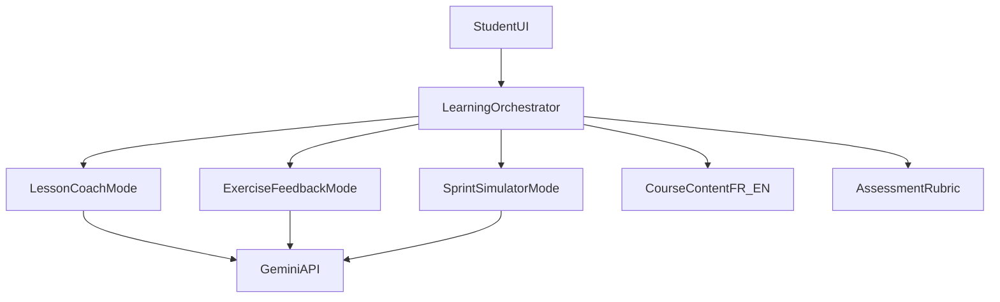

# Gemini Teacher MVP Plan

## Product scope (from your baseline)
- Translate `[context_content/Formation_GenAI_IRCOM.md](context_content/Formation_GenAI_IRCOM.md)` into 4 pedagogical modules that mirror the course blocks:
  - Prompt strategy & copywriting
  - Visual direction & generation
  - Video short-form scripting
  - Agency sprint & critical review
- Keep the app bilingual (FR/EN) with user-selectable language.
- Deliver a light but coherent version of 3 capabilities:
  - Interactive lesson coach
  - Practice exercise + AI feedback
  - Agency sprint scenario simulator

## Architecture (Next.js + TypeScript)
- Use Next.js App Router with server route handlers for Gemini calls.
- Separate concerns:
  - `app/` for pages and API routes
  - `lib/` for Gemini client + prompt templates + content model
  - `components/` for UI blocks (chat panel, rubric panel, mission card)
  - `content/` for structured training data (FR/EN JSON)
- Keep model choice centralized with default `gemini-3-flash-preview` in one config constant.

## Core implementation milestones
- Initialize Next.js TypeScript app scaffold and basic design system primitives.
- Add environment/config layer for Gemini API key + model selection.
- Implement shared AI gateway:
  - Typed request/response contracts
  - Route handler with robust error handling and rate-limit friendly responses
- Encode course baseline into structured content files:
  - Block goals, exercises, expected outputs, rubric criteria
  - FR and EN variants
- Build MVP screens:
  - `/` dashboard with module progression
  - `/coach` guided conversational teacher mode
  - `/exercise` prompt/task submission + AI critique
  - `/sprint` mission generator + deliverable checklist
- Add pedagogical guardrails in prompts:
  - AI as coach, not answer machine
  - Explicit critique phase (detect cliches/hallucinations, suggest human refinement)
- Add lightweight persistence (local first):
  - Session state for student progress, attempts, and feedback history
- Add baseline analytics/logging hooks for usage and failure visibility.

## File plan (expected)
- `[package.json](package.json)` for dependencies/scripts
- `[tsconfig.json](tsconfig.json)` strict TypeScript setup
- `[app/page.tsx](app/page.tsx)` dashboard
- `[app/coach/page.tsx](app/coach/page.tsx)` coach UI
- `[app/exercise/page.tsx](app/exercise/page.tsx)` exercise UI
- `[app/sprint/page.tsx](app/sprint/page.tsx)` sprint UI
- `[app/api/teacher/route.ts](app/api/teacher/route.ts)` Gemini backend endpoint
- `[lib/gemini/client.ts](lib/gemini/client.ts)` model client wrapper
- `[lib/teacher/orchestrator.ts](lib/teacher/orchestrator.ts)` mode routing + prompt assembly
- `[lib/teacher/types.ts](lib/teacher/types.ts)` strict interfaces
- `[content/modules.fr.json](content/modules.fr.json)` FR course structure
- `[content/modules.en.json](content/modules.en.json)` EN course structure
- `[README.md](README.md)` setup and pedagogy mapping

## Validation strategy
- Unit test prompt-orchestration logic and response parsing.
- Add 5 Playwright E2E tests for critical student flows:
  - Switch FR/EN and retain context across modes.
  - Coach mode: complete interaction #1 and interaction #2 in the same session and verify contextual continuity.
  - Exercise mode: submit attempt #1, receive structured critique, revise, then submit attempt #2 and verify progression-aware feedback.
  - Sprint mode: generate mission #1 and mission #2 and verify each includes brief, deliverable checklist, and critique prompts.
  - Cross-mode persistence: complete 2 interactions per mode, then verify progress state reflects all 6 completed interactions.
- Mock Gemini API in E2E via route interception for deterministic runs.

## Risks and mitigations
- Prompt drift / generic answers: use strict system instruction templates + rubric-enforced output schema.
- Hallucinated pedagogy: ground every interaction in the structured module content before generation.
- Bilingual inconsistency: maintain mirrored FR/EN content keys and fallback rules.
- API quota/latency: cache repeatable scaffolding responses and provide graceful retry UX.

## Definition of done (MVP)
- Students can navigate all 3 modes and complete multiple interactions in each (minimum 2 successful interactions per mode).
- AI responses are pedagogically aligned with IRCOM baseline and include actionable critique.
- FR/EN flows are functional.
- Local run + test instructions are documented and reproducible.