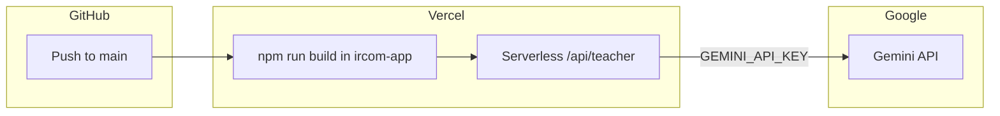

# Deploy IRCOM to Vercel (live)

## Current state

| Item | Status |
|------|--------|
| App | Single Next.js 16 app at [`ircom-app/`](ircom-app/) |
| Git remote | `https://github.com/rglaisner/IRCOM.git` on `main` |
| Backend | Gemini only via [`ircom-app/app/api/teacher/route.ts`](ircom-app/app/api/teacher/route.ts) — no database |
| Env vars | [`ircom-app/.env.example`](ircom-app/.env.example): `GEMINI_API_KEY`, `GEMINI_MODEL` (server-only; safe for Vercel) |
| Vercel config | None committed — standard Next.js defaults are sufficient |
| CI | None — deploy will be Vercel-native |

**Critical Vercel setting:** the repo root is not the app. Vercel must use **Root Directory = `ircom-app`**. If this is left at `.`, the build will fail (no `package.json` at repo root).



---

## What you provide (before / during setup)

1. **Vercel account** logged in at [vercel.com](https://vercel.com).
2. **GitHub authorization** for Vercel to access `rglaisner/IRCOM` (you chose GitHub integration).
3. **`GEMINI_API_KEY`** value (you confirmed you have it) — paste into Vercel env UI; never commit it.
4. **Optional:** custom domain DNS access (only if you want something other than `*.vercel.app`).

No Supabase, Neon, or other marketplace integrations are required for this MVP.

---

## Implementation steps

### 1. Preflight — verify build locally (once)

From [`ircom-app/`](ircom-app/):

```bash
npm ci
npm run build
npm run lint
```

If `build` fails, fix TypeScript/Next issues before linking Vercel (avoids a broken first deployment).

### 2. Create Vercel project from GitHub

1. Vercel Dashboard → **Add New** → **Project** → import **`rglaisner/IRCOM`**.
2. **Root Directory:** click *Edit* → set to **`ircom-app`** → confirm.
3. Framework preset should auto-detect **Next.js** with:
   - **Build Command:** `npm run build` (default)
   - **Install Command:** `npm install` (default)
   - **Output:** Next.js default (no custom `vercel.json` needed)
4. **Production Branch:** `main` (matches your current branch).

### 3. Configure environment variables

In **Project → Settings → Environment Variables**, add:

| Name | Value | Environments |
|------|--------|----------------|
| `GEMINI_API_KEY` | your key | Production, Preview, Development |
| `GEMINI_MODEL` | `gemini-3-flash-preview` (or your chosen model) | Production, Preview (optional but recommended for parity) |

Notes:
- Keys are read in [`ircom-app/lib/gemini/client.ts`](ircom-app/lib/gemini/client.ts) at runtime on the server only.
- Without `GEMINI_API_KEY`, the app still deploys but returns the bilingual **fallback/demo** responses (lines 58–60 in `client.ts`).

### 4. First deploy and promote

1. Click **Deploy** on the import screen (or push an empty commit to `main` to trigger auto-deploy).
2. Wait for build logs to finish green.
3. Open the **Production** URL (`https://<project>.vercel.app`).
4. Smoke-test:
   - `/` dashboard loads
   - `/coach`, `/exercise`, `/sprint` each send a message and receive a structured AI reply (not “fallback mode” copy)
   - Browser Network tab: `POST /api/teacher` returns `200` with `data` payload

### 5. Post-deploy hardening (recommended, small scope)

These are optional follow-ups after the site is live — not blockers for go-live:

| Topic | Recommendation |
|-------|----------------|
| **README** | Add a short “Deploy” section to [`ircom-app/README.md`](ircom-app/README.md): root dir `ircom-app`, required env vars |
| **Preview vs prod** | Use the same `GEMINI_API_KEY` on Preview for PR testing; use a separate Google API key/project if you want cost isolation |
| **Abuse / cost** | No rate limiting today on `/api/teacher`; consider Vercel Firewall or simple rate limits if the URL is public |
| **CI** | Optional GitHub Action: `lint` + `build` on PR (Playwright can stay local or run against Preview URL later) |

No code changes are **required** for a successful Vercel deployment given your answers.

---

## What I will do when you approve execution

1. Run `npm ci && npm run build && npm run lint` in `ircom-app` and fix any build blockers.
2. Guide or run Vercel linking (CLI `vercel link` + `vercel env pull` **or** document exact Dashboard clicks if CLI auth is unavailable in-session).
3. Confirm env vars are documented (not committed).
4. Optionally add a minimal deploy section to [`ircom-app/README.md`](ircom-app/README.md).
5. Report the live Production URL and smoke-test results.

**Out of scope unless you ask:** custom domain DNS, separate staging project, Gemini billing/quota setup in Google Cloud Console.

---

## Success criteria

- Production URL loads all four routes (`/`, `/coach`, `/exercise`, `/sprint`).
- `POST /api/teacher` returns real Gemini JSON (not fallback messaging).
- Pushing to `main` auto-redeploys via GitHub integration.
