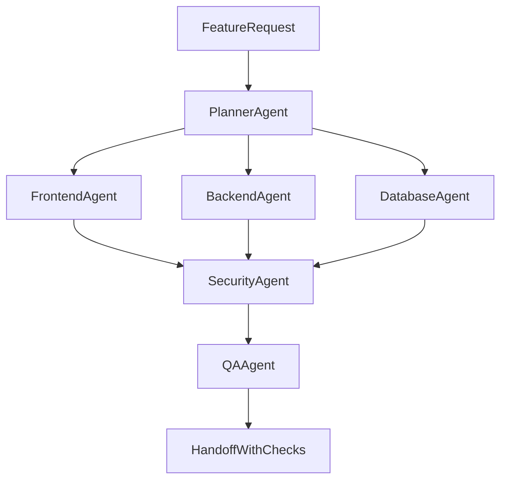

# Vibe Coder Rules + 6-Agent System Plan

## Goal
Translate `context_content/Vibe Coder Cheat Sheet.md` into a practical Cursor-native system with:
- workspace rules that enforce the cheat-sheet operating model
- six specialized agent definitions/prompts for parallel full-stack execution
- a lightweight usage guide so the team can apply the system consistently

## Files To Create
- `.cursor/rules/vibe-coder-core.mdc` (global behavior guardrails)
- `.cursor/rules/vibe-coder-quality.mdc` (error prevention, security/perf checks, readability/testability standards)
- `.cursor/rules/vibe-coder-workflow.mdc` (scoping, pre-flight, rollback/re-strategize, debug-by-example playbook)
- `.cursor/agents/planner.md` (pre-flight architecture/dependency planner)
- `.cursor/agents/frontend.md` (UI/UX implementation specialist)
- `.cursor/agents/backend.md` (API/business logic specialist)
- `.cursor/agents/database.md` (schema/query/migration specialist)
- `.cursor/agents/security.md` (threat and robustness specialist)
- `.cursor/agents/qa.md` (vibe-check and regression testing specialist)
- `.cursor/agents/README.md` (how to route tasks and chain agents)

## Rule Design Mapping (from Cheat Sheet)
- **Focused Scoping + Pre-Flight Checks:** enforce “plan before large generation,” dependencies list, and incremental task slicing.
- **Refactor for Clarity:** require plain-language explanation + readability refactor pass before handoff.
- **Guardrails for External APIs:** require timeout/retry/fallback/error-shape handling defaults.
- **Prompt Engineering for Testability:** require pure-function boundaries and dependency injection where possible.
- **Debug by Example:** standard template requiring failing snippet + known-good snippet comparison.
- **Performance/Security lint mindset:** add mandatory risk checklist at the end of substantial changes.

## Agent Responsibilities
- **Planner:** decomposes feature into scoped subtasks, architecture outline, and dependency plan.
- **Frontend:** builds accessible, maintainable UI with deterministic state boundaries.
- **Backend:** implements typed APIs, business rules, and resilient integration boundaries.
- **Database:** designs schema evolution, constraints, indexes, and migration safety checks.
- **Security:** reviews input handling, auth/authz assumptions, secrets, injection, and failure modes.
- **QA:** builds fast “vibe-check” tests first, then adds edge/regression coverage.

## Orchestration Flow

## Acceptance Criteria
- Rules encode the cheat-sheet practices as enforceable instructions, not generic advice.
- Each agent file has: mission, inputs, outputs, checklist, and done criteria.
- QA agent includes both success and failure-path validation expectations.
- README explains when to run single-agent vs multi-agent flows.
- Wording is concise and operational (copy/paste-ready for Cursor usage).

## Validation Plan
- Run a dry prompt for one sample feature using the Planner + Backend + QA chain.
- Verify generated output follows: pre-flight outline, resilient API handling, and testability requirements.
- Adjust rule language if prompts are too vague or too rigid.