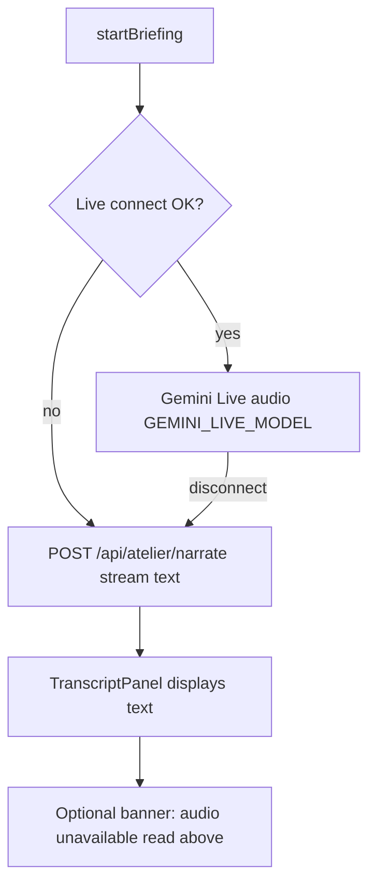

# Workshop & Sprint reliability and pedagogy fixes

## Root-cause summary

| # | User report | Primary cause in code |
|---|-------------|----------------------|
| 1 | Briefing error + browser TTS + pause dead | Live failure sets stale `errorMessage`; fallback calls `speechSynthesis` when `/api/atelier/speak` fails ([`use-voice-briefing.ts`](ircom-app/lib/hooks/use-voice-briefing.ts) L135–137); pause gated on `isLiveActive` only |
| 2 | "Envoyer" has no visible effect | Chat panel hidden by default; Sprint chat uses Atelier-only prompt ([`chat/route.ts`](ircom-app/app/api/atelier/chat/route.ts)); idle-live guard returns `null` silently |
| 3 | Briefs reference missing PDFs | Scenarios mention PDF/whitepaper in JSON only; Atelier has no brief panel unlike Sprint |
| 4 | Silly input accepted | Teacher prompt asks for scores but never enforces pass/fail; no attempt tracking |
| 5 | Timer and briefing unsynced | Separate buttons: `narration-start` vs `sprint-start-timer` ([`sprint-mode.tsx`](ircom-app/components/modes/sprint-mode.tsx)) |

---

## Voice policy (updated per product direction)

### Principles

1. **Audio = Gemini Live only** — use [`GEMINI_LIVE_MODEL`](ircom-app/lib/gemini/models.ts) (`gemini-2.5-flash-native-audio-preview-12-2025`) via the existing Live WebSocket path. Raise-hand live voice exchange stays on the same model family.
2. **Text read = simple narrate API** — when Live is unavailable, stream briefing text via `POST /api/atelier/narrate` (already a straightforward `generateContentStream` call in [`client.ts`](ircom-app/lib/gemini/client.ts)). Display in [`TranscriptPanel`](ircom-app/components/atelier/transcript-panel.tsx). No extra complexity.
3. **No browser TTS ever** — if Gemini audio fails, **do not** fall back to `window.speechSynthesis`. Text-on-screen is the acceptable degraded experience.
4. **Deprecate separate TTS model path** — stop using [`GEMINI_TTS_MODEL`](ircom-app/lib/gemini/models.ts) / [`/api/atelier/speak`](ircom-app/app/api/atelier/speak/route.ts) for briefing. One voice stack (Live), one text stack (narrate). Chat answers are text-only in the brief panel (no auto-speak).

### Target fallback chain

**Removed paths:** `playGeminiTts` → `/api/atelier/speak` → `speechSynthesis`.

### Implementation changes (Phase 1)

| File | Change |
|------|--------|
| [`use-voice-briefing.ts`](ircom-app/lib/hooks/use-voice-briefing.ts) | Remove `useSpeechSynthesis`, `playGeminiTts`, and `speakFallbackText` browser branch. `startBriefing`: Live → on fail, `streamNarration` only (text). `askQuestion`: return text to UI; never speak answers. |
| [`lib/atelier/speech.ts`](ircom-app/lib/atelier/speech.ts) | Keep `useSpeechRecognition` (raise-hand STT). Remove or isolate `useSpeechSynthesis` — not used in briefing/chat paths. |
| [`app/api/atelier/speak/route.ts`](ircom-app/app/api/atelier/speak/route.ts) | Deprecate for briefing (remove client calls). If kept for future use, repoint model from `getGeminiTtsModel()` to `getGeminiLiveModel()` only after verifying AUDIO modality support; otherwise delete route. |
| [`lib/gemini/models.ts`](ircom-app/lib/gemini/models.ts) | Document: `GEMINI_LIVE_MODEL` = sole audio engine. `GEMINI_TTS_MODEL` unused in product flow. Revisit `VoiceEngine = "browser"` — rename to `"live"` only or map `"browser"` to text-only fallback (no synthesis). |
| [`playwright.config.ts`](ircom-app/playwright.config.ts) | Change `NEXT_PUBLIC_VOICE_ENGINE: "browser"` to `"live"` with mocked live-token 503 → expect transcript text, **not** browser speech. |
| [`README.md`](ircom-app/README.md) | Update voice docs: Live → text fallback; no browser TTS. |

### Error UX when Live fails

- Clear stale Live `errorMessage` once narrate stream succeeds.
- Show informational banner (`voiceFallbackNotice` in [`ui-messages.ts`](ircom-app/lib/copy/ui-messages.ts)): FR *"Audio indisponible — lisez le briefing ci-dessus."* / EN *"Audio unavailable — read the briefing above."*
- Reserve red `errorGeneric` only when **both** Live and narrate fail.

### Pause button (Live-only audio)

- `canPause` when Live session is `narrating` / `handRaised` / `paused` resume cycle.
- In text-only fallback mode, pause button stays disabled (nothing to pause); transcript remains readable.
- Remove `isSpeaking` from browser synthesis in pause logic.

---

## Phase 2 — Chat ("Envoyer") visibility and Sprint support

### 2a. Add Sprint chat prompt (mirror narrate route)

- Add `buildSprintChatPrompt()` in [`lib/atelier/pipeline.ts`](ircom-app/lib/atelier/pipeline.ts).
- Extend [`atelierChatRequestSchema`](ircom-app/lib/teacher/types.ts) with `context: "atelier" | "sprint"`.
- Route in [`app/api/atelier/chat/route.ts`](ircom-app/app/api/atelier/chat/route.ts).

### 2b. Remove silent failures in chat UX

- Relax idle-live guard in `askQuestion` — allow chat anytime.
- Append coach replies to transcript / Q&A strip even when chat panel collapsed.
- Auto-open chat on first send; inline errors in chat thread.
- Chat replies: **text display only** (no speak fallback).

---

## Phase 3 — Self-contained briefs (no phantom PDFs)

- Add `briefMarkdown` to Atelier scenario schema ([`curriculum-types.ts`](ircom-app/lib/teacher/curriculum-types.ts)).
- Embed source documents in JSON for scenarios referencing PDFs/press releases (b3, sprint-b-lumina, b1, etc.).
- Add Atelier brief panel (`data-testid="atelier-brief"`) in [`atelier-scenario-workspace.tsx`](ircom-app/components/modes/atelier-scenario-workspace.tsx).
- Update narration/Live prompts: *"All source material is on-screen; never reference an external PDF."*

---

## Phase 4 — Assertive submission validation and 3-strike game-over

- Extend [`teacherResponseSchema`](ircom-app/lib/teacher/types.ts): `submissionVerdict`, `attemptNumber`, `minAcceptableHint`, `idealSubmission`.
- Track attempts per `mode + scenarioId` in [`progress.ts`](ircom-app/lib/teacher/progress.ts).
- Harden [`buildTeacherPrompt`](ircom-app/lib/teacher/pipeline.ts): off_topic / needs_revision / accepted / game_over rules.
- UI in [`teacher-feedback.tsx`](ircom-app/components/studio/teacher-feedback.tsx) + workspace modes: attempt counter, disable submit on game-over, only increment progress on `accepted`.

---

## Phase 5 — Sprint timer ↔ briefing sync

- Starting briefing (`Écouter le briefing`) also starts/resets the 2h timer in [`sprint-mode.tsx`](ircom-app/components/modes/sprint-mode.tsx).
- Demote or remove standalone "Lancer le rush" to avoid double-starts.
- On timer expiry: stop Live audio, show time-up message.

---

## Verification

Update [`tests/e2e/teacher-modes.spec.ts`](ircom-app/tests/e2e/teacher-modes.spec.ts):

- Live mocked 503 + narrate mocked → transcript visible, **no** browser speech invoked.
- Sprint chat with `context: "sprint"` returns visible coach reply.
- Pause enabled only during Live session (not text-only fallback).
- Gibberish submit → `off_topic`; 3rd fail → game-over UI.
- Briefing start → timer running.

Run: `npm run test:e2e` in `ircom-app/`.

---

## File touch list (priority order)

1. [`ircom-app/lib/hooks/use-voice-briefing.ts`](ircom-app/lib/hooks/use-voice-briefing.ts) — Live + text-only fallback, remove browser TTS
2. [`ircom-app/lib/gemini/models.ts`](ircom-app/lib/gemini/models.ts) — single audio model policy
3. [`ircom-app/app/api/atelier/speak/route.ts`](ircom-app/app/api/atelier/speak/route.ts) — deprecate or repoint to Live model
4. [`ircom-app/components/atelier/voice-session-panel.tsx`](ircom-app/components/atelier/voice-session-panel.tsx) — chat visibility, pause props, fallback notice
5. [`ircom-app/lib/atelier/pipeline.ts`](ircom-app/lib/atelier/pipeline.ts) + chat route — Sprint chat
6. [`ircom-app/content/*.json`](ircom-app/content/) — embedded source documents
7. [`ircom-app/lib/teacher/types.ts`](ircom-app/lib/teacher/types.ts) + pipeline + progress — validation
8. [`ircom-app/components/modes/sprint-mode.tsx`](ircom-app/components/modes/sprint-mode.tsx) — timer sync
